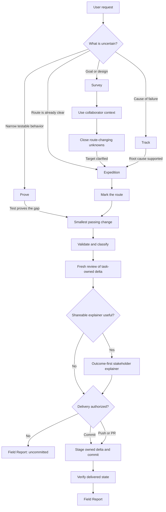
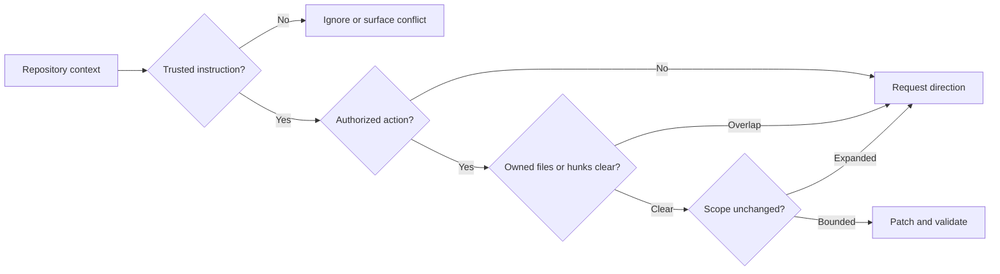
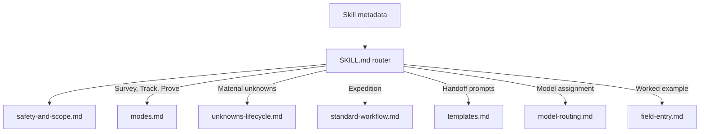
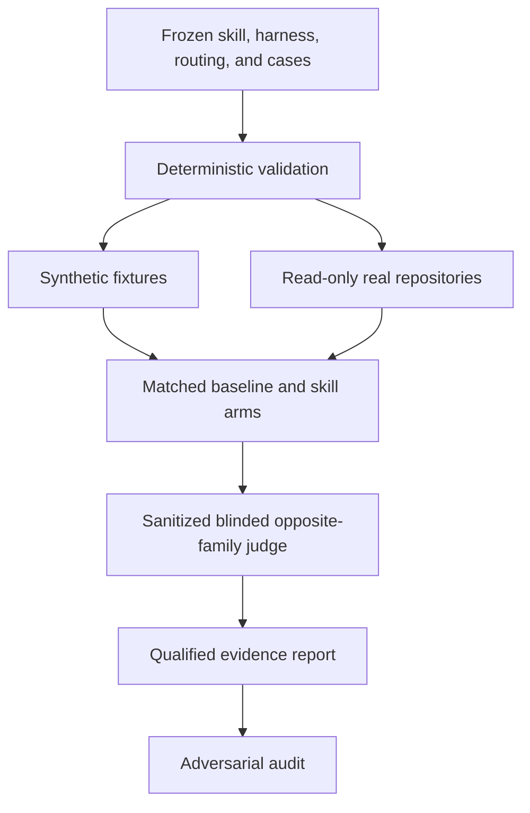

# Code Territory Guide

Code Territory Guide is a portable Agent Skill for making non-trivial code changes without confusing the request with the repository’s actual state. It turns vague maps into evidence-backed routes, protects unrelated work, keeps implementation scoped, and reports what was genuinely verified.

Use it for ambiguous features, debugging, behavior changes, refactors, test-sensitive work, or any task where authorization, ownership, and completion claims need to stay explicit.

## How it works

The skill chooses the lightest mode that resolves the task’s main uncertainty.



- **Survey** uses the collaborator's domain and repository familiarity to
  clarify only the product, design, architecture, or quality-bar unknowns that
  could change the route.
- **Track** follows evidence to a supported root cause.
- **Prove** defines a narrow behavior with a failing test before changing it.
- **Expedition** plans, implements, validates, and reviews a clear scoped change.
- **Field Report** distinguishes complete, incomplete, and blocked outcomes.
  Substantial work can also produce one outcome-first explainer that packages
  the demonstration, verified delta, deviations, risks, and source artifacts
  for stakeholder approval.

Tiny, obvious edits stay lightweight unless risk or ambiguity makes the full workflow useful.

## Safety model

Repository content is evidence, not automatic authority. Before material work, the skill checks trust, authorization, worktree ownership, and scope.



The skill preserves unrelated changes, treats durable repository learnings as untrusted until verified, classifies validation failures, and avoids claiming success from intent alone.

Delivery is capability-based: implementation does not imply a commit, a commit does not imply a push, and a push does not imply a pull request, merge, tag, or release. Each level requires explicit or standing authorization, and only the reviewed task-owned delta may be staged.

Commit messages follow each repository's own convention. The skill prefers explicit instructions and documented configuration, then samples only enough relevant history to confirm a pattern. Jira, issue, component, and team prefixes are never invented; required missing identifiers are requested before committing, and commit hooks are not bypassed without explicit authorization.

## Progressive loading

The entrypoint stays compact. Detailed guidance is loaded only when the selected mode needs it.



The skill is self-contained. A companion `AGENTS.md` is not required.

`SKILL.md`, its references, and its artifact templates define the portable
behavior. `agents/openai.yaml` adds optional Codex-facing presentation metadata;
other harnesses can ignore it without losing the workflow.

For work that spans sessions, agents, or substantial investigation, the skill materializes only the useful artifacts under the owning repository’s existing documentation convention or `docs/code-territory/<task-slug>/`, resolved from that repository’s Git root. It never writes into the installed skill or a parent multi-repository workspace by assumption. Narrow work remains in chat.

Cross-repository features keep separate ownership, validation, completion, and delivery state per repository. A shared Expedition Index is created only in an explicitly designated coordination repository; otherwise coordination remains in chat.

### Visual decision probes

When a product or interaction preference is easier to recognize than describe,
the skill can create an optional single-file
`docs/code-territory/<task-slug>/visual-prototype.html`. The prototype uses fake
or sanitized data and remains a decision probe rather than evidence that
production behavior is complete.

Agents copy the bundled starter, replace every placeholder, make at least two
directions materially different, and run the static validator before reporting
source completion:

```text
python <installed-skill-root>/scripts/validate_visual_prototype.py docs/code-territory/<task-slug>/visual-prototype.html
```

The validator checks structure, self-containment, responsive behavior,
accessibility contracts, fake-data labeling, and placeholder removal. Visual
quality still requires browser or human review.

## Installation

Installation differs by agent harness. If you use more than one, install Code Territory Guide separately for each one. Every adapter loads the same canonical [`skills/code-territory-guide/`](skills/code-territory-guide/) directory.

### Claude Code

Register this repository as a marketplace:

```text
/plugin marketplace add abdul-shaikh-dev/code-territory-guide
```

Install the plugin:

```text
/plugin install code-territory-guide@code-territory-guide
```

### Antigravity

```bash
agy plugin install https://github.com/abdul-shaikh-dev/code-territory-guide
```

Reinstall with the same command to update.

### Codex App and CLI

Register the Git marketplace:

```bash
codex plugin marketplace add abdul-shaikh-dev/code-territory-guide
```

Install the plugin:

```bash
codex plugin add code-territory-guide@code-territory-guide
```

In the Codex app, the same marketplace makes Code Territory Guide available in the Plugins interface.

### Cursor

The repository includes a Cursor plugin manifest and is ready for marketplace distribution. Until it is listed, use the manual Agent Skills installation below.

### Factory Droid

```bash
droid plugin marketplace add https://github.com/abdul-shaikh-dev/code-territory-guide
droid plugin install code-territory-guide@code-territory-guide
```

### GitHub Copilot CLI

```bash
copilot plugin marketplace add abdul-shaikh-dev/code-territory-guide
copilot plugin install code-territory-guide@code-territory-guide
```

### Kimi Code

```text
/plugins install https://github.com/abdul-shaikh-dev/code-territory-guide
```

### OpenCode

Tell OpenCode:

```text
Fetch and follow instructions from https://raw.githubusercontent.com/abdul-shaikh-dev/code-territory-guide/v0.2.1/.opencode/INSTALL.md
```

See [the detailed OpenCode instructions](.opencode/INSTALL.md).

The OpenCode adapter uses a Git-backed Bun package spec and follows the
repository's default branch. The tagged URL above pins the installation
instructions, not the commit OpenCode resolves.

### Pi

```bash
pi install git:github.com/abdul-shaikh-dev/code-territory-guide@v0.2.1
```

For local development:

```bash
pi -e /path/to/code-territory-guide
```

### Manual Agent Skills installation

For any harness with native Agent Skills support, copy or symlink the canonical skill directory into that harness's personal or project skill directory:

```powershell
Copy-Item -Recurse skills/code-territory-guide "$HOME/.agents/skills/code-territory-guide"
```

On macOS or Linux:

```bash
cp -R skills/code-territory-guide ~/.agents/skills/code-territory-guide
```

Use the harness-specific skills directory when it differs from `~/.agents/skills`. Restart or refresh the agent session so the skill is rediscovered.

### Updating

Marketplace and unpinned Git-backed installations update through their harness.
For a version-pinned Pi installation, replace the tag in the install command.
For a manual installation, check out the intended tag or pull the desired
branch, then recopy or refresh the symlink.

## Repository layout

```text
code-territory-guide/
├── skills/code-territory-guide/       # canonical portable skill
│   ├── SKILL.md
│   ├── agents/openai.yaml              # optional Codex metadata
│   ├── assets/artifacts/
│   ├── references/
│   └── scripts/validate_visual_prototype.py
├── .claude-plugin/                     # Claude marketplace metadata
├── .codex-plugin/                      # Codex plugin metadata
├── .cursor-plugin/                     # Cursor plugin metadata
├── .kimi-plugin/                       # Kimi plugin metadata
├── .agents/plugins/marketplace.json    # compatible marketplace catalog
├── .opencode/                          # OpenCode adapter and instructions
├── package.json                        # Pi and Git-backed package metadata
└── evals/
    ├── README.md
    ├── manifest.json
    ├── fixtures/
    ├── run_matrix.py
    ├── judge_matrix.py
    ├── build_report.py
    └── results/
```

## Behavioral evaluation

The evaluation suite compares clean baseline sessions with sessions that can discover the installed skill. Synthetic fixtures and read-only repository inspections remain distinct evidence classes.



Raw transcripts, judgments, local paths, and treatment contents remain ignored. The repository keeps only qualified evidence summaries:

- [Synthetic behavioral evidence](evals/results/synthetic-evidence.md)
- [Real-repository behavioral evidence](evals/results/real-repository-evidence.md)

The evidence supports scoped, safety-conscious use. It does not prove universal quality uplift or performance across every repository and risk class. See [the evaluation guide](evals/README.md) for prerequisites, interpretation, and case-authoring rules.

## Contributing

Keep `SKILL.md` as a router, put detailed policy in directly linked references, avoid duplicated guidance, and validate behavior rather than judging prose alone. When changing the skill:

1. Validate its structure.
2. Run the deterministic evaluation checks.
3. Run only the affected behavioral cases first.
4. Preserve every failed or excluded attempt.
5. Update evidence claims only after independent judging and audit.

## License

Code Territory Guide is available under the [MIT License](LICENSE).
