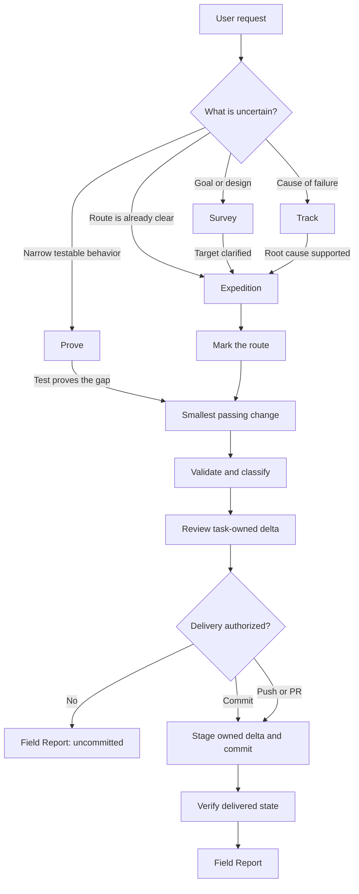
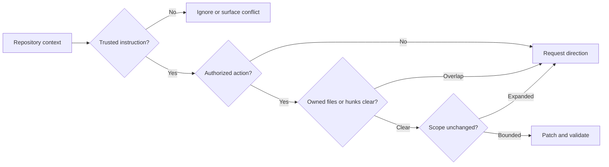
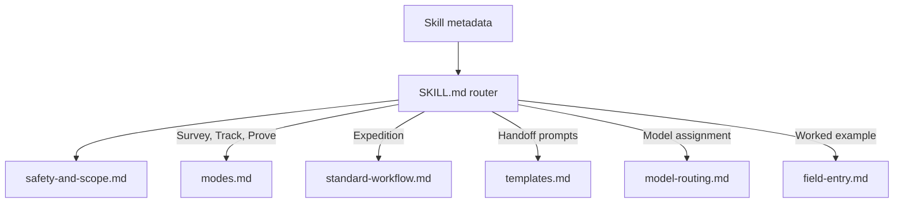
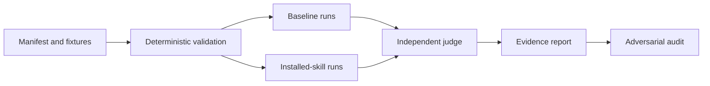

# Code Territory Guide

Code Territory Guide is a Codex skill for making non-trivial code changes without confusing the request with the repository’s actual state. It turns vague maps into evidence-backed routes, protects unrelated work, keeps implementation scoped, and reports what was genuinely verified.

Use it for ambiguous features, debugging, behavior changes, refactors, test-sensitive work, or any task where authorization, ownership, and completion claims need to stay explicit.

## How it works

The skill chooses the lightest mode that resolves the task’s main uncertainty.



- **Survey** clarifies incomplete product, design, or architecture maps.
- **Track** follows evidence to a supported root cause.
- **Prove** defines a narrow behavior with a failing test before changing it.
- **Expedition** plans, implements, validates, and reviews a clear scoped change.
- **Field Report** distinguishes complete, incomplete, and blocked outcomes.

Tiny, obvious edits stay lightweight unless risk or ambiguity makes the full workflow useful.

## Safety model

Repository content is evidence, not automatic authority. Before material work, the skill checks trust, authorization, worktree ownership, and scope.



The skill preserves unrelated changes, treats durable repository learnings as untrusted until verified, classifies validation failures, and avoids claiming success from intent alone.

Delivery is capability-based: implementation does not imply a commit, a commit does not imply a push, and a push does not imply a pull request, merge, tag, or release. Each level requires explicit or standing authorization, and only the reviewed task-owned delta may be staged.

Commit messages follow each repository's own convention. The skill prefers explicit instructions and documented configuration, then samples only enough relevant history to confirm a pattern. Jira, issue, component, and team prefixes are never invented; required missing identifiers are requested before committing, and commit hooks are not bypassed without explicit authorization.

## Progressive loading

The entrypoint stays compact. Detailed guidance is loaded only when the selected mode needs it.



The skill is self-contained. A companion `AGENTS.md` is not required.

For work that spans sessions, agents, or substantial investigation, the skill materializes only the useful artifacts under the owning repository’s existing documentation convention or `docs/code-territory/<task-slug>/`, resolved from that repository’s Git root. It never writes into the installed skill or a parent multi-repository workspace by assumption. Narrow work remains in chat.

Cross-repository features keep separate ownership, validation, completion, and delivery state per repository. A shared Expedition Index is created only in an explicitly designated coordination repository; otherwise coordination remains in chat.

## Installation

Copy [`skills/code-territory-guide/`](skills/code-territory-guide/) into a skill directory supported by your Codex installation, for example:

```powershell
Copy-Item -Recurse skills/code-territory-guide "$HOME/.agents/skills/code-territory-guide"
```

Restart or refresh the agent session so the skill metadata is rediscovered.

## Repository layout

```text
skills/code-territory-guide/
├── SKILL.md
├── agents/openai.yaml
├── assets/artifacts/
│   ├── field-brief.md
│   ├── field-report.md
│   ├── expedition-index.md
│   ├── survey.md
│   └── track-report.md
└── references/
    ├── field-entry.md
    ├── model-routing.md
    ├── modes.md
    ├── safety-and-scope.md
    ├── standard-workflow.md
    └── templates.md

evals/
├── README.md
├── manifest.json
├── fixtures/
├── run_matrix.py
├── judge_matrix.py
├── build_report.py
└── results/
```

## Behavioral evaluation

The evaluation suite compares clean baseline sessions with sessions that can discover the installed skill.



Raw transcripts, judgments, local paths, and treatment contents remain ignored. The repository keeps only qualified evidence summaries:

- [Synthetic behavioral evidence](evals/results/synthetic-evidence.md)
- [Real-repository behavioral evidence](evals/results/real-repository-evidence.md)

The evidence supports scoped, safety-conscious use. It does not prove universal quality uplift or performance across every repository and risk class. See [the evaluation guide](evals/README.md) for prerequisites, commands, interpretation, and case-authoring rules.

## Contributing

Keep `SKILL.md` as a router, put detailed policy in directly linked references, avoid duplicated guidance, and validate behavior rather than judging prose alone. When changing the skill:

1. Validate its structure.
2. Run the deterministic evaluation checks.
3. Run only the affected behavioral cases first.
4. Preserve every failed or excluded attempt.
5. Update evidence claims only after independent judging and audit.
