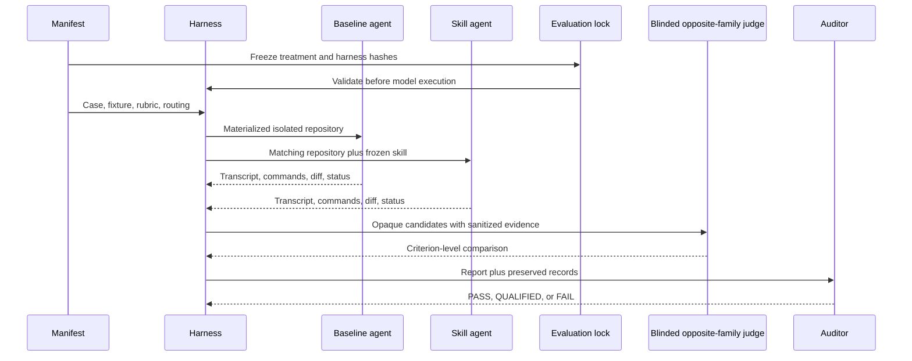

# Behavioral Evaluation Guide

This directory tests whether Code Territory Guide changes observable agent behavior. It is development and release evidence for the skill, not part of the installed skill itself.

## What the suite measures

The synthetic matrix covers proportional process, explicit authorization, hidden scope expansion, dirty-worktree ownership, prompt injection, validation-failure classification, environmental blockers, review fallback, standalone operation, and positive or negative triggering.

It also covers durable project-root artifacts, commit conventions in dirty worktrees, missing required ticket identifiers, and coordinated multi-repository delivery behavior.

The unknowns-lifecycle cases cover one-at-a-time interviewing for a
route-changing ambiguity, reversible exploration of recognition-based
preferences, source-reference semantics, and durable notes for a material plan
deviation.

They also cover collaborator-calibrated blind-spot teaching and a shareable
stakeholder explainer that leads with the demonstrated outcome before technical
review evidence.

Each case has two arms:

- **baseline** — a clean isolated agent home without the skill
- **installed-skill** — the same materialized Git fixture with only Code Territory Guide installed

A separate-call judge scores both arms against the manifest rubric. For locked runs, the judge receives only sanitized opaque candidates, runs in an isolated Codex home without the treatment plugin, and is routed to the opposite configured model family. A separate auditor checks whether the generated report is supported by the preserved records.



## When to run evaluations

Run deterministic validation after any manifest, fixture, schema, routing, or harness change.

Before a release-quality model run, freeze the exact treatment and harness. The runners reject missing, stale, or too-early locks before starting Codex:

```powershell
python evals/freeze_evaluation.py --release-id <release-id> --minimum-attempt <next-attempt>
```

The lock is prospective. Never describe evidence from an earlier attempt as preregistered by a later lock.

Run focused baseline/treatment cases when a skill change could affect:

- mode selection or triggering
- authorization or confirmation behavior
- scope and worktree ownership
- repository trust handling
- implementation, validation, review, or completion claims

Run the full matrix before a release or after a substantial policy rewrite. Do not launch model runs for documentation-only changes unless the documentation changes agent-facing skill instructions.

## Safety and cost boundaries

The synthetic harness creates disposable Git repositories and isolated home directories. It copies Codex authentication into the temporary home and invokes real model sessions, so full runs consume model capacity.

The nested runtime must provide actual workspace-write and shell execution for writable cases to be scoreable. A run denied by platform policy is retained and judged, but reported as environment-limited rather than evidence that artifact creation, commits, hooks, or multi-repository implementation succeeded.

The canonical runner requests `workspace-write`, uses non-interactive `never` approval mode, and ignores inherited user execution rules inside its isolated home. It does not use danger-full-access or bypass the sandbox.

When a managed platform overrides `workspace-write` with read-only execution, a user may explicitly authorize `--allow-unsandboxed-write` for disposable fixtures. This maps to the Codex bypass flag, is recorded as `explicit-unsandboxed-disposable-fixture`, sanitizes inherited environment variables, and must never be used with real repositories or enabled by default.

- Never point the synthetic harness at a real repository.
- Never publish raw records; they may contain local paths or loaded skill contents.
- Never delete failed attempts to improve the result.
- Use a new positive `--attempt` number; the runner refuses to overwrite evidence.
- Keep baseline and treatment routing and fixtures identical.
- Freeze the skill tree for a release-quality comparison.
- Treat timeouts, missing responses, or treatment mutation according to `exclusion-policy.md`.
- Real-repository evaluation requires separately prepared local clones with disabled push URLs. Review `real-repo-manifest.json` and `run_real_repo_eval.py` before using it.

## Prerequisites

- Python 3.11 or later
- Git on `PATH`
- Codex CLI on `PATH`
- An authenticated Codex installation with `~/.codex/auth.json`
- A writable temporary directory
- Enough model allowance for the selected cases and judge calls

By default, temporary repositories use the operating system’s temporary directory. Set `CTG_EVAL_TEMP_ROOT` to choose another writable location.

## Quick deterministic check

These commands do not launch model sessions:

```powershell
python evals/validate_manifest.py
python evals/validate_records.py
python -m unittest discover -s evals/tests -v
```

`validate_records.py` also succeeds when no ignored local run records exist; it validates the schemas and every record that is present.

## Run a focused synthetic comparison

First inspect available IDs in `evals/manifest.json`, create or review `evals/evaluation-lock.json`, and use an attempt at or above its `preregistered_for_attempts_gte` value. Then run one paired case:

```powershell
$env:CTG_EVAL_TEMP_ROOT = "$env:TEMP/code-territory-guide-evals"
python evals/run_matrix.py --case hidden-scope-expansion --arm both --attempt 20
```

Useful options:

```text
--case <id>                       run one manifest case
--arm baseline|installed-skill|both
--attempt <positive integer>      identify a non-overwriting repetition
```

Run all baselines before all treatments for a complete matrix:

```powershell
python evals/run_matrix.py --arm baseline --attempt 20
python evals/run_matrix.py --arm installed-skill --attempt 20
```

Records are written beneath `evals/results/runs/` and remain ignored.

## Judge and report

The judge requires a valid, lock-matching baseline and treatment record for every selected case. It receives the rubric, exact shared query, and sanitized observable evidence under deterministic `candidate_a` and `candidate_b` labels. It does not receive run IDs, arm labels, source-model metadata, or treatment contents. The process uses a clean temporary Codex home, so a normally installed Code Territory Guide plugin does not contaminate judging.

```powershell
python evals/judge_matrix.py --case hidden-scope-expansion --attempt 20
python evals/judge_matrix.py --attempt 20
python evals/validate_records.py
python evals/build_report.py
```

Judgment artifacts are written beneath `evals/results/judgments/` and remain ignored. `build_report.py` selects a judgment only when it references the latest non-excluded baseline and treatment records, reports the selected attempt, preserves retry history and the curated audit section, and updates `results/synthetic-evidence.md`. It reports same-treatment retry consistency and execution-environment coverage without turning either into a broader reliability claim.

Run the optional independent evidence audit only after reviewing the generated report:

```powershell
python evals/audit_evidence.py --attempt 20
```

The audit is a real model session. Preserve its raw artifacts locally and commit a concise qualified conclusion only when the evidence supports it.

## Real-repository evaluation

The historical real-repository harness is intentionally separate from the synthetic matrix. It is for read-only behavior against explicitly prepared local clones, not arbitrary user repositories.

Before running:

1. Inspect every clone and record its base commit.
2. Create a local evaluation branch.
3. Set each push URL to `DISABLED`.
4. Confirm the task prompt forbids edits and network access.
5. Freeze the evaluation, then update a new reviewed real-repository evaluation version so its treatment hash matches the active lock. Do not rewrite the manifest that anchors historical evidence.
6. Read the scripts because clone locations and selected evidence are evaluation-specific.

```powershell
python evals/run_real_repo_eval.py --help
python evals/judge_real_repo_eval.py --help
python evals/build_real_repo_report.py
python evals/validate_real_repo_eval.py
```

The runner validates the active lock before a model call and records that lock in every future run. If the current manifest is historical, it fails closed and asks for a new reviewed evaluation version. The builder writes its reproducible read-only report beneath `results/generated/`; it does not overwrite the curated release evidence. Do not run this path merely because local clones exist. It is a controlled experiment requiring a reviewed manifest and isolation setup.

## Writable real-repository evaluation

The v2 writable harness measures implementation behavior without changing the seed clones or any remote. Each case and arm receives a separate disposable local clone at an exact registered commit. Before a model starts, both fetch and push URLs are set to DISABLED. A valid run must leave exactly one local fix commit, a clean worktree, a nonempty committed delta, stable provisioned dependencies, and observable execution of every registered validation command.

This workflow must be launched from a normal PowerShell terminal that honors nested workspace-write. It does not use danger-full-access. Do not run it from a managed session known to silently downgrade nested execution to read-only.

### 1. Prepare the local seeds

The registered seed root contains CogStash, CogVest, and copilot-credit-simulator at the commits in `real-repo-writable-manifest.json`. Keep every seed clean. Provision dependencies before the model cohort so the model sessions do not need package-network access:

```powershell
cd G:\Projects\2026\cool_projects\code-territory-guide-real-repos\CogStash
uv sync --frozen --extra dev

cd G:\Projects\2026\cool_projects\code-territory-guide-real-repos\CogVest
npm ci
```

Dependency setup may use the network. The evaluated model sessions may not. The simulator has no provisioned dependency directory in this cohort.

### 2. Set isolated roots and validate

```powershell
cd G:\Projects\2026\cool_projects\code-territory-guide

$env:CTG_REAL_REPO_SEED_ROOT = "G:\Projects\2026\cool_projects\code-territory-guide-real-repos"
$env:CTG_REAL_REPO_TEMP_ROOT = "$PWD\.real-eval-temp"

python evals/validate_real_repo_writable_eval.py
python -m unittest discover -s evals/tests -v
```

The seed and session roots must not overlap. The runner rejects dirty or wrong-commit seeds, symlink or junction seed roots, stale locks, enabled remotes, and missing provisioned dependencies before useful evidence can be accepted.

### 3. Run and inspect one paired canary

```powershell
python evals/run_real_repo_writable_eval.py --case simulator-zero-capacity --arm both --attempt 22 --keep-workspaces

$baseline = Get-Content evals/results/real-repos-writable/runs/simulator-zero-capacity--baseline--attempt-22.json | ConvertFrom-Json
$treatment = Get-Content evals/results/real-repos-writable/runs/simulator-zero-capacity--installed-skill--attempt-22.json | ConvertFrom-Json
$baseline | Select-Object run_id, changed_files, validation_observed, excluded
$treatment | Select-Object run_id, changed_files, validation_observed, excluded
```

Continue only when both records show actual changed files, exactly one commit from the base, clean final status, disabled fetch and push URLs, all validation commands observed, and excluded.value equal to false. The runner aborts the cohort on the first excluded or failed arm.

### 4. Resume the cohort, judge, and report

```powershell
python evals/run_real_repo_writable_eval.py --attempt 22 --resume
python evals/judge_real_repo_writable_eval.py --run-attempt 22 --judge-attempt 22 --resume
python evals/build_real_repo_writable_report.py --run-attempt 22 --judge-attempt 22
python evals/validate_real_repo_writable_eval.py
```

Resume preserves successful records rather than rerunning them. The judge uses sanitized opaque candidates in a separate call and routes to the configured opposite model family. The builder refuses excluded, mismatched, unlocked, uncommitted, dirty, or incomplete evidence.

The optional adversarial audit is another model call and should run only after the report and preserved records have been reviewed:

```powershell
python evals/audit_real_repo_writable_eval.py --attempt 22
```

Raw records, transcripts, judgments, local paths, and disposable sessions remain ignored. Only the qualified Markdown report is suitable for version control. Network-capable commands are grounds for exclusion, but network denial is not independently OS-enforced because Codex itself requires API connectivity.

## Evidence boundaries

The tracked reports distinguish four environments: synthetic unsandboxed disposable fixtures, synthetic ordinary workspace-write fixtures, read-only real repositories, and writable real-repository feature branches. Evidence in one row does not establish behavior in another.

The current historical cohort may remain valid evidence while predating preregistration, opaque judging, or opposite-family judges. Validators preserve that history, while schema 3 records and future judgments must satisfy the stronger lock and blinding rules.

## Reading outcomes

- **PASS** — the report’s stated claims are supported by the preserved evidence.
- **QUALIFIED** — useful claims are supported, but limitations prevent broader conclusions.
- **FAIL** — material claims are unsupported or evidence integrity is inadequate.

A passing treatment is not automatically an improvement. Report pairwise outcomes as improved, preserved, regressed, or inconclusive. Never turn missing observable behavior into a pass based on intent.

## Adding or changing a case

1. Add the smallest fixture evidence needed under `fixtures/<case-id>/`.
2. Add one manifest entry with a realistic query.
3. Define observable expected criteria and explicit forbidden behavior.
4. Implement materialization in `materialize_fixture.py`.
5. Validate the manifest.
6. Run the new case in both arms with a fresh attempt number.
7. Judge it independently and inspect the worktree evidence.

Do not include the intended solution, suspected bug, or skill policy in the user prompt. The agent should succeed from transferable behavior, not leaked ground truth.

## Tracked versus generated files

Track manifests, fixtures, schemas, harness scripts, documentation, and concise qualified evidence summaries.

Keep transcripts, stderr, structured run records, judgment records, temporary repositories, local clone paths, and treatment payloads ignored. Before committing, verify with:

```powershell
git status --short
git check-ignore -v evals/results/runs/example.json
```
