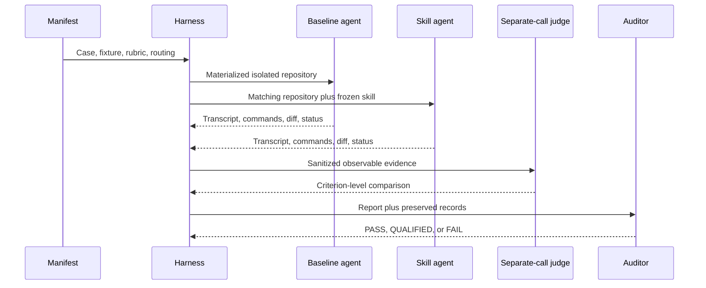

# Behavioral Evaluation Guide

This directory tests whether Code Territory Guide changes observable agent behavior. It is development and release evidence for the skill, not part of the installed skill itself.

## What the suite measures

The synthetic matrix covers proportional process, explicit authorization, hidden scope expansion, dirty-worktree ownership, prompt injection, validation-failure classification, environmental blockers, review fallback, standalone operation, and positive or negative triggering.

It also covers durable project-root artifacts, commit conventions in dirty worktrees, missing required ticket identifiers, and coordinated multi-repository delivery behavior.

Each case has two arms:

- **baseline** — a clean isolated agent home without the skill
- **installed-skill** — the same materialized Git fixture with only Code Territory Guide installed

A separate-call judge scores both arms against the manifest rubric. The evaluator may use the same model family as an arm, so this is process separation rather than guaranteed model independence. A separate auditor checks whether the generated report is supported by the preserved records.



## When to run evaluations

Run deterministic validation after any manifest, fixture, schema, routing, or harness change.

Run focused baseline/treatment cases when a skill change could affect:

- mode selection or triggering
- authorization or confirmation behavior
- scope and worktree ownership
- repository trust handling
- implementation, validation, review, or completion claims

Run the full matrix before a release or after a substantial policy rewrite. Do not launch model runs for documentation-only changes unless the documentation changes agent-facing skill instructions.

## Safety and cost boundaries

The synthetic harness creates disposable Git repositories and isolated home directories. It copies Codex authentication into the temporary home and invokes real model sessions, so full runs consume model capacity.

The nested runtime must provide actual workspace-write and shell execution for writable cases to be scoreable. A run denied by platform policy is retained and judged, but reported as environment-limited rather than evidence that artifact creation, commits, hooks, or multi-repository implementation succeeded.

The canonical runner requests `workspace-write`, uses non-interactive `never` approval mode, and ignores inherited user execution rules inside its isolated home. It does not use danger-full-access or bypass the sandbox.

When a managed platform overrides `workspace-write` with read-only execution, a user may explicitly authorize `--allow-unsandboxed-write` for disposable fixtures. This maps to the Codex bypass flag, is recorded as `explicit-unsandboxed-disposable-fixture`, sanitizes inherited environment variables, and must never be used with real repositories or enabled by default.

- Never point the synthetic harness at a real repository.
- Never publish raw records; they may contain local paths or loaded skill contents.
- Never delete failed attempts to improve the result.
- Use a new positive `--attempt` number; the runner refuses to overwrite evidence.
- Keep baseline and treatment routing and fixtures identical.
- Freeze the skill tree for a release-quality comparison.
- Treat timeouts, missing responses, or treatment mutation according to `exclusion-policy.md`.
- Real-repository evaluation requires separately prepared local clones with disabled push URLs. Review `real-repo-manifest.json` and `run_real_repo_eval.py` before using it.

## Prerequisites

- Python 3.11 or later
- Git on `PATH`
- Codex CLI on `PATH`
- An authenticated Codex installation with `~/.codex/auth.json`
- A writable temporary directory
- Enough model allowance for the selected cases and judge calls

By default, temporary repositories use the operating system’s temporary directory. Set `CTG_EVAL_TEMP_ROOT` to choose another writable location.

## Quick deterministic check

These commands do not launch model sessions:

```powershell
python evals/validate_manifest.py
python evals/validate_records.py
```

`validate_records.py` also succeeds when no ignored local run records exist; it validates the schemas and every record that is present.

## Run a focused synthetic comparison

First inspect available IDs in `evals/manifest.json`. Then run one paired case:

```powershell
$env:CTG_EVAL_TEMP_ROOT = "$env:TEMP/code-territory-guide-evals"
python evals/run_matrix.py --case hidden-scope-expansion --arm both --attempt 1
```

Useful options:

```text
--case <id>                       run one manifest case
--arm baseline|installed-skill|both
--attempt <positive integer>      identify a non-overwriting repetition
```

Run all baselines before all treatments for a complete matrix:

```powershell
python evals/run_matrix.py --arm baseline --attempt 1
python evals/run_matrix.py --arm installed-skill --attempt 1
```

Records are written beneath `evals/results/runs/` and remain ignored.

## Judge and report

The judge requires a valid baseline and treatment record for every selected case. It receives the exact recorded full query used by both arms, including shared harness boundary text. Ensure Code Territory Guide is not installed in the normal user-level skill locations while judging, so the judge cannot discover the treatment.

```powershell
python evals/judge_matrix.py --case hidden-scope-expansion --attempt 1
python evals/judge_matrix.py --attempt 1
python evals/validate_records.py
python evals/build_report.py
```

Judgment artifacts are written beneath `evals/results/judgments/` and remain ignored. `build_report.py` selects a judgment only when it references the latest non-excluded baseline and treatment records, reports the selected attempt, preserves retry history, and updates `results/synthetic-evidence.md`.

Run the optional independent evidence audit only after reviewing the generated report:

```powershell
python evals/audit_evidence.py --attempt 1
```

The audit is a real model session. Preserve its raw artifacts locally and commit a concise qualified conclusion only when the evidence supports it.

## Real-repository evaluation

The real-repository harness is intentionally separate from the synthetic matrix. It is for read-only behavior against explicitly prepared local clones, not arbitrary user repositories.

Before running:

1. Inspect every clone and record its base commit.
2. Create a local evaluation branch.
3. Set each push URL to `DISABLED`.
4. Confirm the task prompt forbids edits and network access.
5. Update `real-repo-manifest.json` with the frozen treatment hash and approved routing.
6. Read the scripts because clone locations and selected evidence are evaluation-specific.

```powershell
python evals/run_real_repo_eval.py --help
python evals/judge_real_repo_eval.py --help
python evals/build_real_repo_report.py
python evals/validate_real_repo_eval.py
```

The builder writes its reproducible read-only report beneath `results/generated/`; it does not overwrite the curated release evidence. Do not run this path merely because local clones exist. It is a controlled experiment requiring a reviewed manifest and isolation setup.

## Reading outcomes

- **PASS** — the report’s stated claims are supported by the preserved evidence.
- **QUALIFIED** — useful claims are supported, but limitations prevent broader conclusions.
- **FAIL** — material claims are unsupported or evidence integrity is inadequate.

A passing treatment is not automatically an improvement. Report pairwise outcomes as improved, preserved, regressed, or inconclusive. Never turn missing observable behavior into a pass based on intent.

## Adding or changing a case

1. Add the smallest fixture evidence needed under `fixtures/<case-id>/`.
2. Add one manifest entry with a realistic query.
3. Define observable expected criteria and explicit forbidden behavior.
4. Implement materialization in `materialize_fixture.py`.
5. Validate the manifest.
6. Run the new case in both arms with a fresh attempt number.
7. Judge it independently and inspect the worktree evidence.

Do not include the intended solution, suspected bug, or skill policy in the user prompt. The agent should succeed from transferable behavior, not leaked ground truth.

## Tracked versus generated files

Track manifests, fixtures, schemas, harness scripts, documentation, and concise qualified evidence summaries.

Keep transcripts, stderr, structured run records, judgment records, temporary repositories, local clone paths, and treatment payloads ignored. Before committing, verify with:

```powershell
git status --short
git check-ignore -v evals/results/runs/example.json
```
